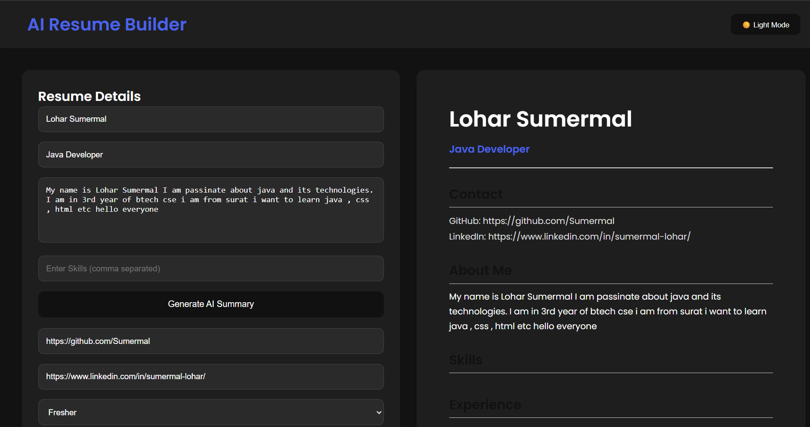

# 🚀 Smart Resume Builder

A modern and responsive Smart Resume Builder built using HTML, CSS, and JavaScript.

This project allows users to create professional resumes with live preview, multiple templates, dark mode, PDF download, project management, and responsive UI.

---

## ✨ Features

- 🎨 Multiple Resume Templates
- 🌙 Dark Mode / Light Mode
- 📄 Download Resume as PDF
- 🖼 Upload Profile Image
- 🧠 Smart Resume Summary Generator
- 🛠 Add, Edit, and Delete Projects
- 🏷 Skills Tags System
- 🔗 Clickable GitHub & LinkedIn Links
- 💾 LocalStorage Data Saving
- 📱 Fully Responsive Design

---

## 🛠 Technologies Used

- HTML5
- CSS3
- JavaScript (Vanilla JS)
- html2canvas
- jsPDF

---

## 📸 Preview




## 📂 Project Structure

```bash
smart-resume-builder/
│
├── index.html
├── style.css
├── script.js
└── README.md
```

---

## 🚀 How To Run

1. Clone the repository

```bash
git clone https://github.com/Sumermal/smart-resume-builder.git
```

2. Open project folder

```bash
cd smart-resume-builder
```

3. Open `index.html` using Live Server in VS Code

---

## 🎯 Future Improvements

- 🤖 Real AI API Integration
- 📤 Share Resume Link
- 📑 More Resume Templates
- 🖱 Drag & Drop Sections
- ☁ Cloud Storage Support

---

## 👨‍💻 Developer

LOHAR SUMERMAL

---

## ⭐ If you like this project

Give it a star on GitHub ⭐
